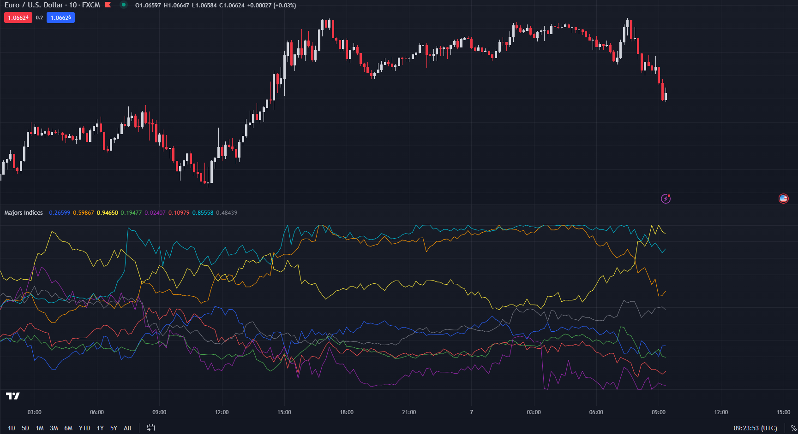

Personalized major indices, calculated through their market capital.

Usage: 
Copy majors-custom-indices.tradingview file and past in Pine Editor.

Options: 
Periods: bars taken in consideration for the normalization interval. More value of high value and more flattened graphics.
Tick value expression: How the value of the tick is calculated, (es. hlcc4, Is a shortcut for (high + low + close + close)/4)
Display and hide indices and choose colors.
Change predefined data suppliers for symbols.

Need Enanchments.

